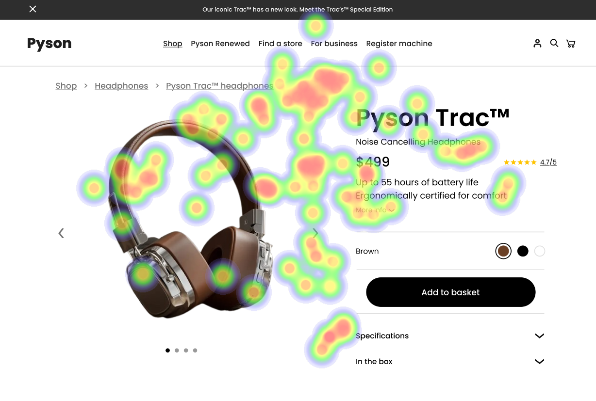
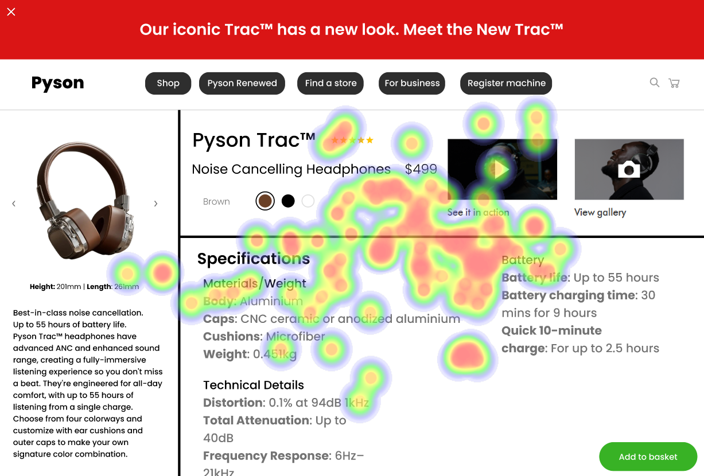
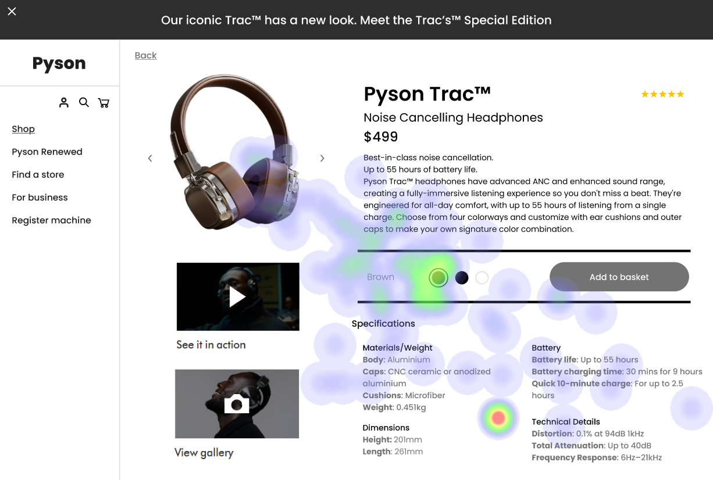

# UI Recommendations Report

## Image 1

### Strengths
- The product image is large, centrally placed, and visually appealing. 🎨
  - Heatmap data shows high fixation on the product image, confirming its effectiveness in capturing user attention.
- The product name and price are prominently displayed next to the image. 💰
  - Heatmap indicates significant attention on the product name and price, supporting their importance in user decision-making.

### Weaknesses
- **Low Contrast of 'Specifications' and 'In the Box' Links**  
  - Reason: These links are presented with insufficient contrast, making them visually less accessible.  
  - Heatmap correlation: Minimal fixation on these links indicates poor visibility and user engagement.  
  - Severity: High  
  - Impact: Reduced visibility of these links may lead to users missing important product details, affecting their purchasing decisions.  
  - Recommendations: Increase the contrast ratio to at least 4.5:1. This can involve changing the background color or text color to ensure that these links stand out against the background. 🔧

- **Distracting Navigation Bar**  
  - Reason: The navigation bar draws attention away from the main product content.  
  - Heatmap correlation: Scattered attention on the navigation bar suggests it competes with the product image for user focus.  
  - Severity: Medium  
  - Impact: The distraction may prevent users from efficiently locating and evaluating product details.  
  - Recommendations: Simplify the navigation bar by reducing the number of items displayed or consider placing it on a secondary screen or dropdown. 📊

## Image 2

### Strengths
- The product image (Pyson Trac headphones) is large and centrally placed. 🎧
  - Heatmap shows significant fixation on the product image, confirming its effectiveness in capturing user attention.
- The price and star rating are prominently displayed near the product title. ⭐️
  - Heatmap shows high attention on the price and rating, confirming their importance in user decision-making processes.

### Weaknesses
- **Low Contrast and Poor Placement of the 'Add to Basket' Button**  
  - Reason: Button's low contrast with the background and unconventional placement make it easily overlooked.  
  - Heatmap correlation: Minimal fixation on the 'Add to Basket' button supports poor visibility.  
  - Severity: High  
  - Impact: Users may struggle to locate the button, leading to frustration and potential abandonment of the purchase process.  
  - Recommendations: Increase the button's contrast to at least 4.5:1 and reposition it to a more prominent area, such as directly below the product image. 🛒

- **Cluttered and Overwhelming Specifications Section**  
  - Reason: The dense presentation and lack of hierarchy make it difficult for users to process the information quickly.  
  - Heatmap correlation: Scattered fixation in the specifications section indicates users are struggling to focus.  
  - Severity: Medium  
  - Impact: This may hinder users from making informed decisions due to overwhelmed perception.  
  - Recommendations: Redesign the specifications section using bullet points and clear subheadings to facilitate visual processing and enhance user engagement. 📜

## Image 3

### Strengths
- The product image is large and visually dominant. 🔍
  - Heatmap shows high fixation on the product image, confirming its effectiveness in drawing user attention.
- The product name and price are bold and clearly positioned. 💵
  - Heatmap data shows significant attention on the product name and price, validating their effective placement.

### Weaknesses
- **Low Contrast of 'Add to Basket' Button**  
  - Reason: The button is not easily noticeable due to low contrast, reducing its visibility.  
  - Heatmap correlation: Minimal fixation on the 'Add to Basket' button confirms poor visibility.  
  - Severity: High  
  - Impact: Users may overlook the button, impacting conversion rates severely.  
  - Recommendations: Increase the button's contrast to meet the recommended 4.5:1 ratio with the background, and consider moving it closer to the product image. ⚠️

- **Cluttered Specifications Section**  
  - Reason: Specifications are presented densely without clear separation, making them difficult to process.  
  - Heatmap indicates limited attention on the specifications, suggesting users find this area overwhelming.  
  - Severity: Medium  
  - Impact: Users may skip important details due to cognitive overload.  
  - Recommendations: Apply a grid layout for the specifications section with ample whitespace to improve clarity and user engagement. ✨

### WCAG Standards

- The UI partially meets WCAG 2.1 standards at Level AA. Key improvements should focus on:
  - Enhancing contrast for accessibility
  - Ensuring all interactive elements are easily identifiable

This report outlines key strengths and weaknesses for each analyzed image along with recommendations for improvement to enhance user experience and accessibility.

## Performance Metrics
- Total execution time: 198.33 seconds
- CrewAI analysis time: 50.23 seconds

