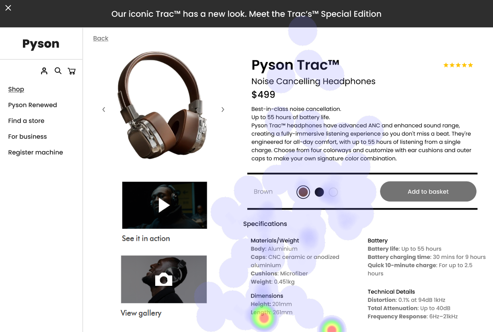

# UI Recommendations Report

## Image 1

### Strengths
- The product image is prominently placed and visually appealing, aligning with the F-pattern of user attention. 
  - 📊 Heatmap data shows high fixation on the product image, confirming its effectiveness in capturing user attention.
  
- The product name and price are centrally located and highlighted with contrasting colors. 
  - 📊 Heatmap data supports high attention in this area, validating its prominence and importance.

### Weaknesses
- **Low Contrast of 'Add to Basket' Button**
  - Reason: The low contrast makes the button less noticeable, potentially reducing conversions. 
  - 📊 Heatmap data shows minimal attention on the 'Add to Basket' button, supporting its poor visibility.
  - Severity: High
  - Impact: This issue directly impacts conversion rates due to the button's critical role in facilitating purchases. 
  - **Recommendations:**
    - Increase the button's contrast to meet the WCAG minimum contrast ratio of 4.5:1.
    - Reposition it to the top-right corner for improved visibility. 
    - 🎨

- **Cluttered Specifications Section**
  - Reason: Dense text in the specifications section can overwhelm users. 
  - 📊 Heatmap data shows scattered attention in this area, indicating user difficulty in focusing.
  - Severity: Medium
  - Impact: Overwhelming text can make it difficult for users to process information, leading to potential frustration and abandonment.
  - **Recommendations:**
    - Reorganize the specifications section by using bullet points and headings to improve readability. 
    - 📄 

### WCAG Compliance
The UI partially meets WCAG 2.1 standards at Level AA. While the product image and key information are visually clear, the low contrast of the 'Add to Basket' button and cluttered specifications section deviate from WCAG guidelines. Recommendations include improving button contrast and reorganizing the specifications section for better readability.

## Image 2

### Strengths
- The product image is centrally placed and effectively captures user interest. 
  - 📊 The heatmap shows high fixation on the product image, confirming its effectiveness in capturing user attention.

- The product name and price are prominently displayed in a large font. 
  - 📊 The heatmap indicates significant attention on the product name and price, validating their strategic placement.

### Weaknesses
- **Low Contrast in Navigation Bar**
  - Reason: The low contrast between the navigation links and the background reduces visibility. 
  - 📊 The heatmap shows minimal attention on the navigation bar, indicating users may overlook it due to poor contrast.
  - Severity: Medium
  - Impact: Reduced visibility of navigation links may hinder users from navigating the site effectively, potentially leading to frustration.
  - **Recommendations:**
    - Enhance the contrast ratio for navigation links, ensuring it meets the minimum of 4.5:1.
    - Consider increasing font size for better clarity. 
    - 🔍

- **Poor Placement of 'See it in action' Video**
  - Reason: The video is positioned below the primary product image. 
  - 📊 The heatmap shows lower fixation on the video compared to the product image, indicating potential missed engagement.
  - Severity: Low
  - Impact: The underutilization of the video may reduce user engagement with the product demonstration.
  - **Recommendations:**
    - Reposition the video above the product image or next to it to increase its visibility and encourage user interaction. 
    - 📹 

### WCAG Compliance
The UI partially meets WCAG 2.1 standards at Level AA. Improvements are needed, particularly in navigation contrast visibility and video placement.

## Image 3

### Strengths
- The product image is large and centrally placed, aligning with user attention. 
  - 📊 The heatmap shows high fixation on the product image, confirming its effectiveness in drawing attention.

- The product name and price are prominently displayed with clear typography. 
  - 📊 The heatmap confirms significant attention on this area, supporting its strategic importance.

### Weaknesses
- **Low visibility of the 'Add to Basket' button**
  - Reason: The button has low contrast with the background, making it less noticeable. 
  - 📊 The heatmap shows minimal fixation on the button, aligning with its poor visibility.
  - Severity: High
  - Impact: This can lead to overlooking the critical call-to-action element, thereby impacting conversion rates.
  - **Recommendations:**
    - Increase button contrast to at least 4.5:1.
    - Consider relocating it to a more visually aligned position in the layout, such as the top-right. 
    - 🔼 

- **Cluttered navigation bar**
  - Reason: The navigation bar is overwhelming, making it hard for users to find needed options quickly. 
  - 📊 Heatmap data indicates scattered attention across the navigation bar.
  - Severity: Medium
  - Impact: This can result in user frustration and hinder exploration of other products.
  - **Recommendations:**
    - Simplify the navigation bar by limiting options to the most critical links.
    - Potentially organize them into dropdowns for a cleaner look. 
    - 🗂️ 

### WCAG Compliance
The UI meets WCAG 2.1 Level AA standards, with particular attention needed for enhancing the contrast of the 'Add to Basket' button and simplifying navigation elements.

## Performance Metrics
- Total execution time: 160.22 seconds
- CrewAI analysis time: 33.18 seconds

